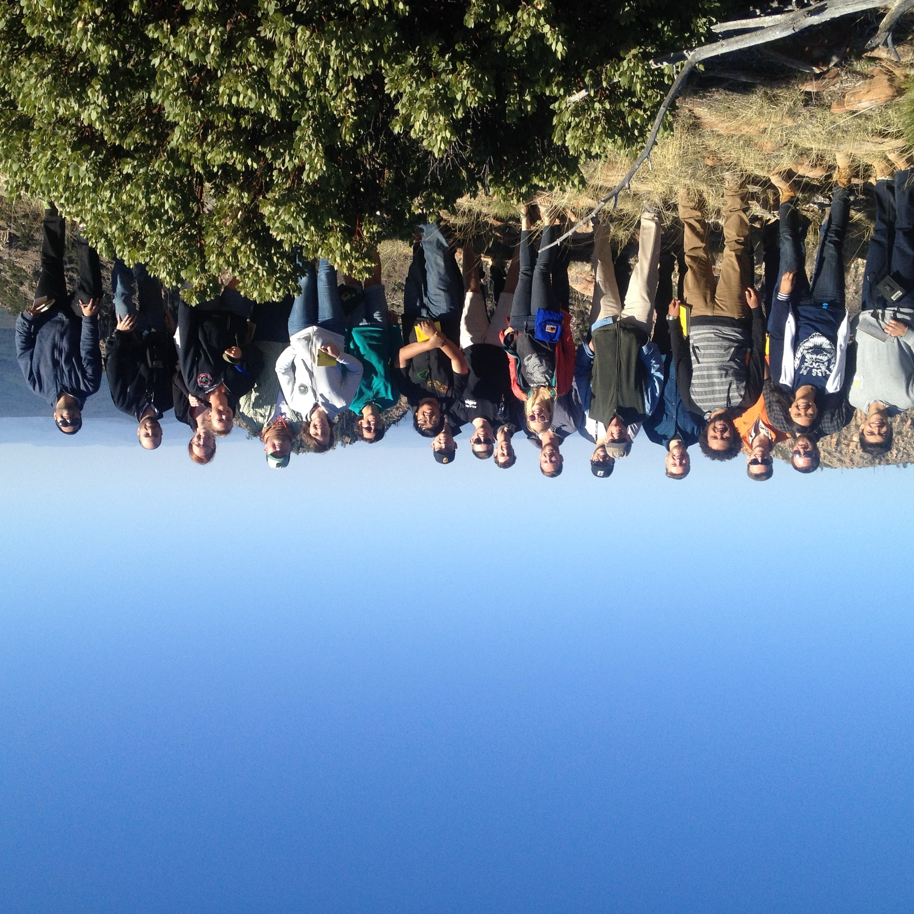
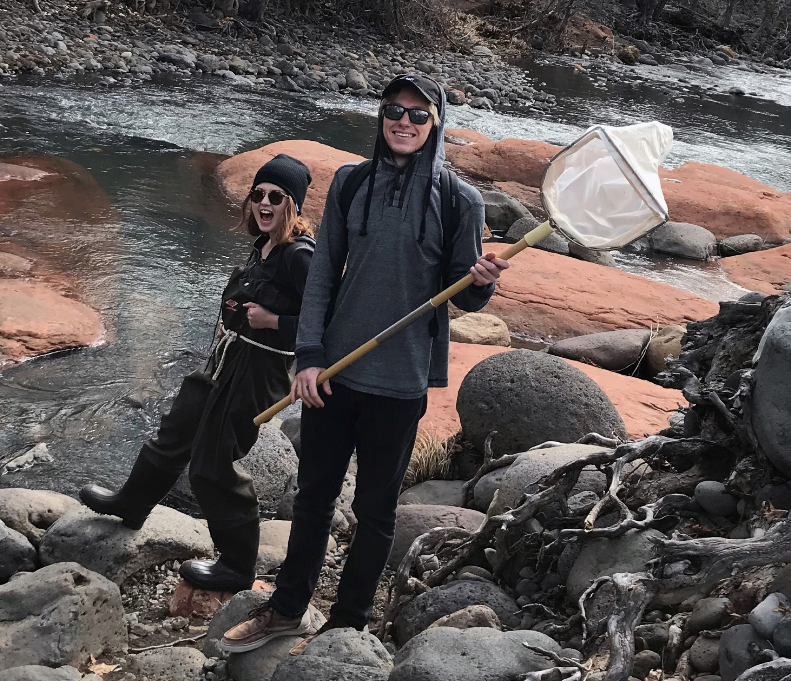
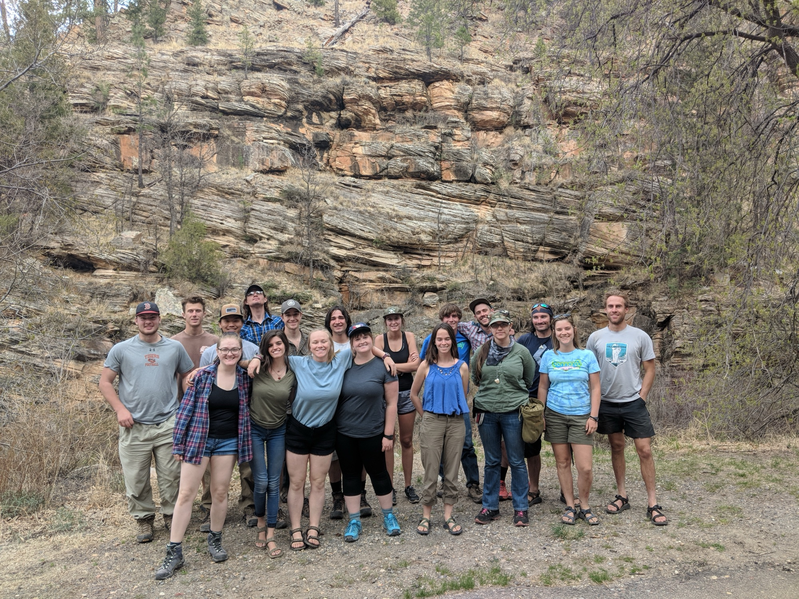
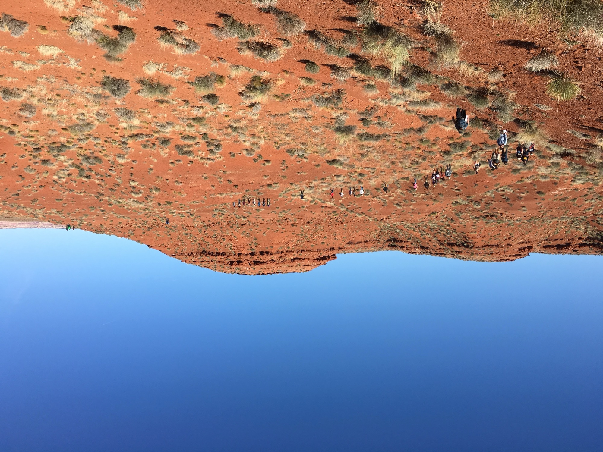
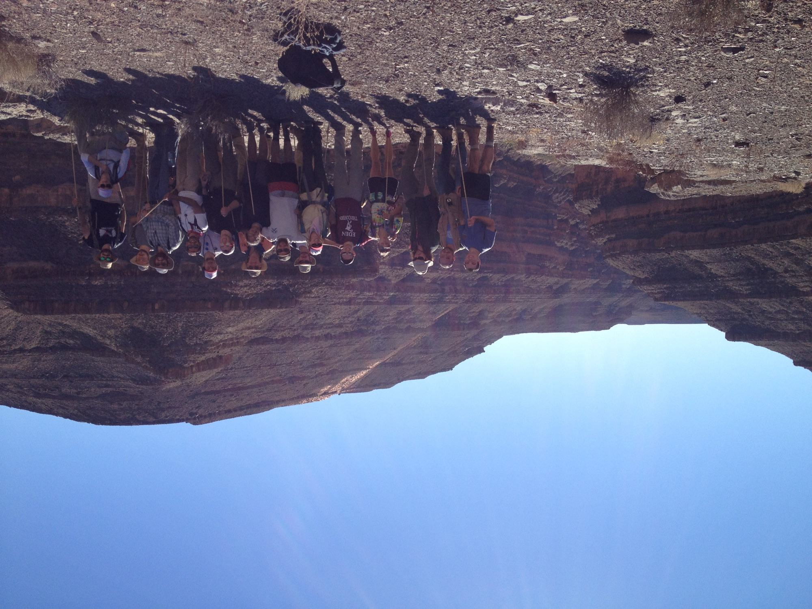
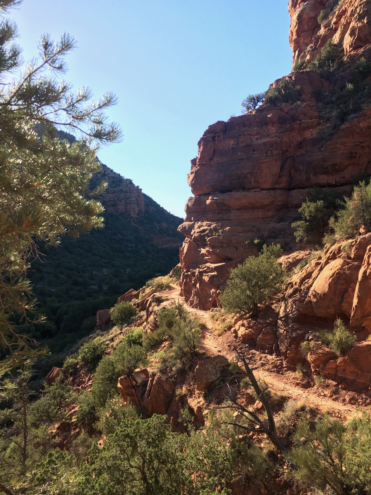
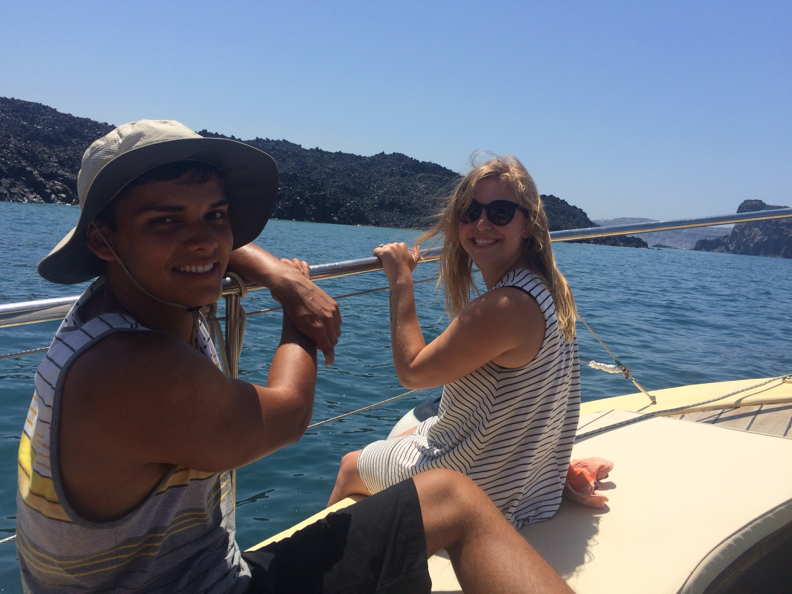

At 7,000 feet on the Colorado Plateau, Flagstaff sits inside the best natural
laboratory in North America, and our courses use it that way. Most weeks,
some SES class is outside: measuring a stream, mapping a rock unit, coring a
lake, or standing on a rim arguing about what the landscape is saying.

## Close to home

*Sedimentary geology students working the edge of the Mogollon Rim, where the
Colorado Plateau breaks away toward central Arizona.*

Within a day trip of campus: the Grand Canyon, Sedona's red rocks, the San
Francisco volcanic field, Meteor Crater, the painted badlands of the Little
Colorado, and forest, desert, and alpine ecosystems stacked within an hour's
drive of each other. Introductory geology courses (GLG 324) read the
stratigraphy at Sedona and swim the narrows of East Clear Creek; environmental
science courses (ENV 324) wade local streams with nets and turbidity meters.

*ENV 324 students sampling stream invertebrates.*

*Reading canyon walls at East Clear Creek.*

## The region

*GLG 340 in the slickrock country of southern Utah.*

Upper-division and graduate courses range farther: mapping in southern Utah
(GLG 340), field geophysics and geomorphology across the Southwest,
sedimentology on the San Juan River's canyon walls (GLG 627), and desert
processes at Death Valley (GLG 440C). Trips are working trips: students
measure sections, run instruments, and defend interpretations on the outcrop.

*Measuring section above the San Juan River.*

*Canyon-country transit between field stops.*

## Farther afield

*Surveying the Santorini caldera by boat, NAU in Greece.*

Summer programs take SES students abroad, including **NAU in Greece**, where
geology students map volcanic stratigraphy on Santorini and study the
archaeology of the Aegean's eruptions firsthand.

## The point

Field courses aren't a supplement here; they're the curriculum. Employers and
graduate programs consistently tell us that SES students arrive knowing how
to work outdoors: how to plan a traverse, run equipment in wind and dust,
keep a field notebook, and turn a landscape into data.

Interested? See the [undergraduate degree programs](/student-opportunities/undergraduate-degrees/)
and [graduate degrees](/student-opportunities/graduate-degrees/), or just
[come visit](/contact/); the field trips are easier to explain outside.
