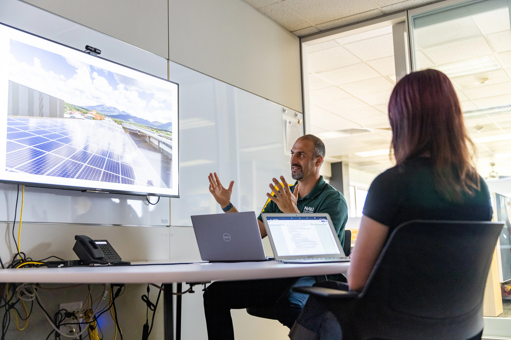

## Graduate Degree Programs

The School of Earth and Sustainability offers four comprehensive graduate degree programs designed to prepare students for advanced careers in research, industry, government, and academia.

Already an SES grad student? Head to [Current Students](/current-students/) for handbooks, course planning, defense procedures, and funding.

## Master of Science in Geology (MS)

**[Complete Program Details](/student-opportunities/geology-ms/)**

### Program Overview
- **Focus Areas:** Sedimentary, igneous, and metamorphic rocks; stratigraphy, structure, volcanology, surficial processes, water resources
- **Application Deadline:** January 1st
- **Duration:** Typically 2 years

### Research Themes
- Past & Present Climate Change
- Tectonics & Earth's Interior
- Sedimentary Geology & Geomorphology
- Water Management Policy & Science

### Funding Opportunities
- Research Assistantships with $15,000+ annual stipend
- Teaching Assistantships with $15,000+ annual stipend
- Tuition waiver included with assistantships
- Additional research grants available

### Career Outcomes
- **90% employment rate** upon graduation
- Environmental consulting firms
- Energy industry positions
- Federal and state government agencies
- Teaching and education roles
- PhD program preparation

## Master of Science in Environmental Sciences and Policy (MS)

**[Complete Program Details](/student-opportunities/environmental-sciences-policy/)**

### Program Overview
- **Duration:** Two-year program
- **Application Deadline:** January 1st
- **Emphasis Areas:** Environmental Sciences and Policy, Paleoenvironmental Sciences

### Research Areas
- Past & Present Climate Change
- Water Management Policy & Science
- Ecology & Conservation
- Environment & Society

### Funding Opportunities
- Research and Teaching Assistantships with $15,000+ stipend
- Wyss Scholars program for exceptional students
- Tuition remission with assistantships
- External fellowship opportunities

### Career Outcomes
- Government agencies (EPA, USGS, NOAA)
- Non-profit environmental organizations
- Private sector environmental consulting
- Policy research institutions
- Entrepreneurial environmental projects

## Master of Science in Climate Science and Solutions (MS)

**[Complete Program Details](/student-opportunities/climate-science-solutions/)**

### Program Overview
- **Type:** Professional Science Master's degree
- **Duration:** 18-month, non-thesis program
- **Total Credits:** 36 (18 core, 12 electives, 6 career development)

### Core Curriculum
- Climate change science fundamentals
- Environmental economics
- Greenhouse gas management
- Sustainable systems design
- Environmental discourse and communication

### Special Features
- **Professional Summer Internship:** Mandatory industry experience
- **Industry Advisory Board:** Direct input from industry professionals
- **Career Development:** Professional skills and networking focus
- **Accelerated Timeline:** Complete degree in 1.5 years

### Target Background
- Engineering graduates
- Science degree holders
- Environmental Studies majors
- Business professionals seeking environmental expertise

### Career Opportunities
- Climate consulting firms
- Corporate sustainability departments
- Government climate agencies
- Renewable energy companies
- Environmental policy organizations

## Doctor of Philosophy in Earth Sciences and Environmental Sustainability (PhD)

**[Complete Program Details](/student-opportunities/earth-sciences-environmental-sustainability-phd/)**

### Program Overview
- **Requirements:** 30 course units, comprehensive examination, dissertation
- **Application Deadline:** January 1st
- **Duration:** Typically 4-6 years

### Emphasis Areas
- **Earth Systems:** Geological processes and earth system interactions
- **Climate & Environmental Change:** Paleoclimatology and modern climate dynamics
- **Ecology Evolution & Conservation Biology:** Biodiversity and ecosystem conservation
- **Environment & Society:** Human-environment interactions and policy
- **Engineering Sustainable Systems:** Technical solutions for sustainability challenges

### Program Requirements
- **Coursework:** Minimum 30 units of graduate-level courses
- **Comprehensive Exam:** Written and oral examinations in area of specialization
- **Dissertation Research:** Original research contribution to the field
- **Teaching Experience:** Required teaching or outreach component

### Funding Support
- Research Assistantships: $20,000-$27,000 annual stipend
- Teaching Assistantships: $20,000-$27,000 annual stipend
- Full tuition waiver included
- Health insurance coverage
- Conference travel support

### Career Focus
- University faculty positions
- Government research agencies
- Private sector R&D roles
- Environmental consulting leadership
- Policy research institutions
- International organizations

*PhD students engage in cutting-edge research and professional development opportunities*

# Guidance for applying to NAU’s graduate school to pursue an advanced degrees in SES

First, if you plan to apply to a thesis-based program (ESP MS, GLG MS, and ESES PhD), [get to know our faculty](/faculty-profiles/) and [review current opportunities for students](/student-opportunities/). **It is very important that you reach out to faculty members you would be interested in working with before you apply**. Faculty expect to receive emails from prospective students and will be happy to hear from you about your specific interests. They can also tell you more about their research and if they have space available in their labs.

Second, entry into any SES Graduate Program requires an online application through the Office of Graduate and Professional Studies. A completed application for admission will include:

- An online application for admission to the NAU Office of Graduate and Professional Studies, with the required application fee;
- Transcripts of all undergraduate and graduate course work;
- Three letters of recommendation from academic or professional supervisors (download the referee form from the online application);
- A statement of your interests and goals, and your reasons for pursuing an advanced degree;
- (For all thesis-based programs – ESP MS, GLG MS, and ESES PhD) names of the faculty advisor(s) you have been in contact with and would like to work with;
- Submission by the January 1st application deadline.

## Contact Information

**Email:** SES.Admin@nau.edu  
**Phone:** 928-523-9333  
**Location:** Room A108, Building 11, Ashurst, NAU Flagstaff Campus

**Graduate Program Coordinator:** Contact for specific program information and application guidance

  **[Apply to NAU](https://nau.edu/apply/)**
