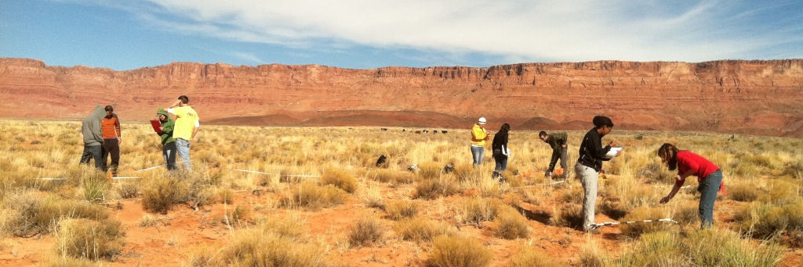
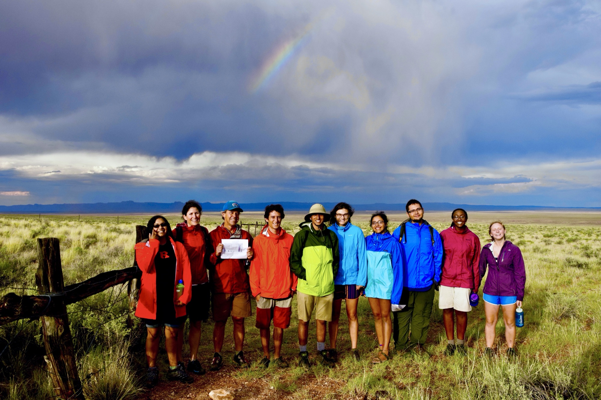

## Sisk Graduate Fellowship in Conservation Science at Northern Arizona University

*Conservation Biology class in House Rock Valley, studying grazing impacts. Photo by Tom Sisk.*

The Sisk Graduate Fellowship in Conservation Science is designed to recruit and support the next generation of conservation leaders who reflect the diverse communities of the U.S. Southwest. The fellowship advances interdisciplinary approaches to conservation and strengthens collaboration between academia and practitioners by fostering partnerships between NAU and external conservation organizations.

Established in honor of Dr. Thomas D. Sisk, inaugural Olajos-Goslow Chair of Environmental Science and Policy for the Southwest (2011 to 2021), the fellowship supports outstanding graduate students committed to leadership in ecological science, conservation, and environmental policy.

### Eligibility

The award is open to students enrolled in M.S. or Ph.D. programs at Northern Arizona University. Preference will be given to students in the M.S. in Environmental Science and Policy and the Ph.D. in Earth Sciences and Environmental Sustainability; however, applicants from any NAU graduate program whose work aligns with the fellowship's purpose are encouraged to apply. Candidates should demonstrate a commitment to interdisciplinary, collaborative approaches and to advancing conservation outcomes that serve all communities across the Southwest.

### How to Apply

The Fellowship Application traditionally opens in the Spring and will be reviewed by a selection committee. If you would like to submit your Sisk Fellowship application to the selection committee, please email Dr. Clare Aslan at [clare.aslan@nau.edu](mailto:clare.aslan@nau.edu) for instructions and information.

### Sisk Fellow Spotlight

To read more about NAU's first Sisk Fellow, Shawna Woody, visit: [Sisk Fellow honors heritage through conservation](https://www.foundationnau.org/s/1898/21/interior.aspx?sid=1898&gid=2&pgid=2859&cid=5553&ecid=5553&crid=0&calpgid=981&calcid=2572).

### Support the Fellowship

You can make a difference in the lives of Lumberjacks and support the Sisk Fellowship by [donating to the NAU Foundation](https://www.foundationnau.org/s/1898/giving19/landing.aspx?sid=1898&gid=2&sitebuilder=1&pgid=672).

### Contact

If you have questions about the Sisk Fellowship program, please email the Director of the School of Earth and Sustainability, Dr. Clare Aslan at [clare.aslan@nau.edu](mailto:clare.aslan@nau.edu).

*Students lining up to match the colors of the rainbow, after a thunderstorm in the House Rock Valley. Photo by Melissa Mark.*
