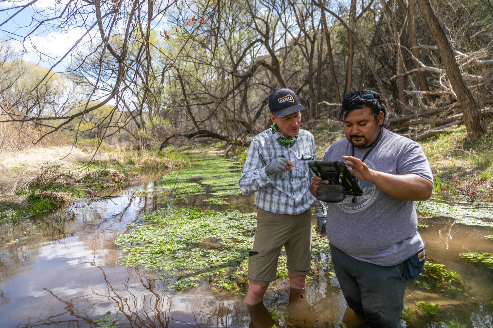

## Undergraduate Degree Programs

The School of Earth and Sustainability offers five undergraduate degree programs designed to provide students with comprehensive knowledge and hands-on experience in earth sciences, environmental science, and sustainability studies.

## Geology Bachelor of Science (BS)

  

    <h5 class="mb-0">
      <button class="btn btn-link btn-block text-left" type="button" data-toggle="collapse" data-target="#geologyBSCollapse" aria-expanded="true" aria-controls="geologyBSCollapse">
        <i class="fas fa-chevron-down"></i> View Program Details
      </button>
    </h5>
  

  

    

### Program Overview
- **Total Units:** 120
- **Major Requirements:** 70-72 units
- **Minimum GPA:** 2.5 for major courses

### Description
Develops interdisciplinary knowledge to understand the physical and biological history of the Earth. This program emphasizes field and laboratory experiences that prepare students for professional careers in geology.

### Key Features
- Extensive field and laboratory experiences
- Preparation for potential professional licensure
- Strong foundation in earth sciences
- Individual research opportunities

*Students conducting hands-on geological fieldwork and research projects*

### Career Outcomes
- Professional geologist careers with potential for licensure
- Environmental consulting
- Natural resource exploration
- Government agencies (USGS, state geological surveys)
- Graduate school preparation

    

  

## Environmental Sciences Bachelor of Science (BS)

  

    <h5 class="mb-0">
      <button class="btn btn-link btn-block text-left collapsed" type="button" data-toggle="collapse" data-target="#envSciBSCollapse" aria-expanded="false" aria-controls="envSciBSCollapse">
        <i class="fas fa-chevron-down"></i> View Program Details
      </button>
    </h5>
  

  

    

### Program Overview
- **Total Units:** 120
- **Minimum GPA:** 2.0
- **Multiple Emphasis Areas Available**

### Description
Interdisciplinary degree exploring environmental problems and solutions through scientific approaches. Students gain hands-on learning experiences and can specialize in various emphasis areas.

### Emphasis Areas
- Environmental Geology
- Applied Statistics
- Environmental Administration and Policy
- Biology
- Chemistry
- Climate
- Environmental Communication
- Environmental Management

### Career Outcomes
- Environmental consulting firms
- Government environmental agencies
- Non-profit environmental organizations
- Graduate programs in environmental fields
- Corporate sustainability positions

    

  

## Environmental and Sustainability Studies Bachelor of Arts (BA)

  

    <h5 class="mb-0">
      <button class="btn btn-link btn-block text-left collapsed" type="button" data-toggle="collapse" data-target="#essBACollapse" aria-expanded="false" aria-controls="essBACollapse">
        <i class="fas fa-chevron-down"></i> View Program Details
      </button>
    </h5>
  

  

    

### Program Overview
- **Total Units:** 120
- **Major Requirements:** 57 units
- **Foreign Language:** 16 units required

### Description
Integrates natural sciences, social sciences, and humanities to address complex environmental and sustainability challenges. This program takes a holistic approach to environmental problem-solving.

### Special Programs
- Optional accelerated 4+1 graduate programs
- Potential Bachelor/Juris Doctor 3+3 program

### Career Focus
- Non-profit organizations
- Government agencies
- Community organizations
- Environmental education
- Policy and advocacy roles

    

  

## Environmental and Sustainability Studies Bachelor of Science (BS)

  

    <h5 class="mb-0">
      <button class="btn btn-link btn-block text-left collapsed" type="button" data-toggle="collapse" data-target="#essBSCollapse" aria-expanded="false" aria-controls="essBSCollapse">
        <i class="fas fa-chevron-down"></i> View Program Details
      </button>
    </h5>
  

  

    

### Program Overview
- **Total Units:** 120
- **Major Requirements:** 63-64 units
- **Minimum Major GPA:** 2.0

### Description
Focuses on real-world solutions to environmental and sustainability challenges with a stronger emphasis on scientific and technical approaches compared to the BA program.

### Accelerated Options
- 4+1 MA in Sustainable Communities
- 4+1 MS in Climate Science & Solutions

### Career Paths
- Non-profit organizations
- Government agencies
- Community action organizations
- Environmental consulting
- Sustainable business practices

    

  

## Earth Science Bachelor of Science in Education (BSED)

  

    <h5 class="mb-0">
      <button class="btn btn-link btn-block text-left collapsed" type="button" data-toggle="collapse" data-target="#bsedCollapse" aria-expanded="false" aria-controls="bsedCollapse">
        <i class="fas fa-chevron-down"></i> View Program Details
      </button>
    </h5>
  

  

    

### Program Overview
- **Total Units:** 120
- **Major Units:** 99 units
- **Minimum GPA:** 2.5

### Description
Prepares students to teach Earth sciences in grades 6-12. This program combines strong scientific content knowledge with pedagogical training for effective science teaching.

### Certification
- Arizona teaching certification
- Nationally recognized by NSTA (National Science Teachers Association)

### Requirements
- Minimum 2.5 GPA
- Complete TSM 101 with "C" or better
- Student teaching experience
- Pass required certification exams

### Career Outcome
- Secondary science teacher certification
- Educational leadership opportunities
- Science curriculum development
- Educational outreach programs

    

  

## Application Information

### Admission Requirements
- High school diploma or equivalent
- Satisfactory SAT or ACT scores
- Completed application to Northern Arizona University
- Official transcripts from all previous institutions

### Student Support Services
- Professional academic advisors
- Faculty mentorship programs
- Career counseling services
- Graduate school preparation guidance

## Contact Information

**Email:** SES.Admin@nau.edu  
**Phone:** 928-523-9333  
**Location:** Room A108, Building 11, Ashurst, NAU Flagstaff Campus

  <a href="https://nau.edu/apply/" class="btn btn-success btn-lg" target="_blank">Apply to NAU</a>

